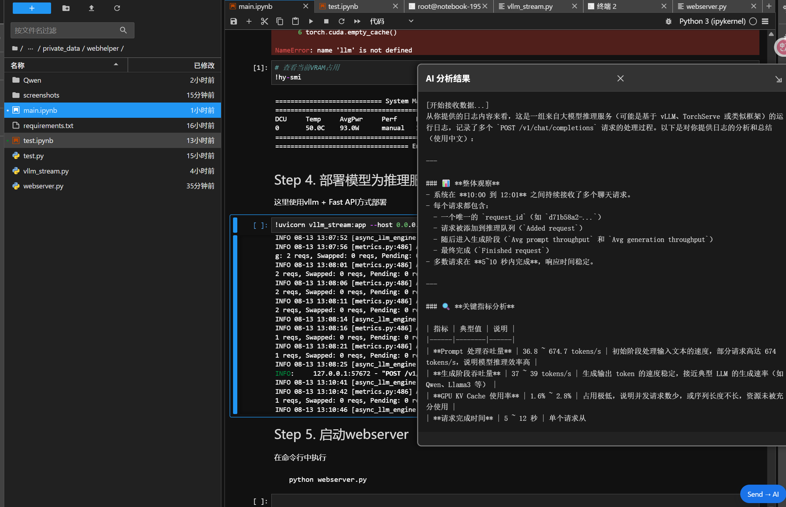
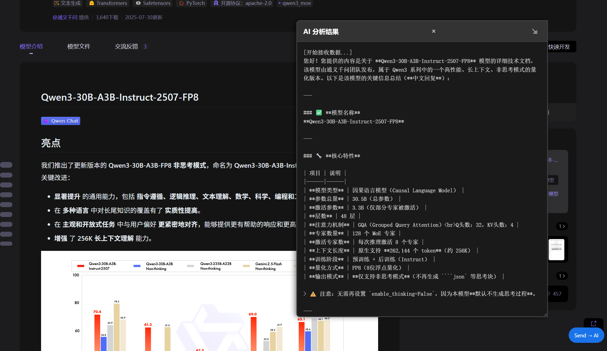

# AI Web Helper


AI Web Helper 是一个浏览器扩展插件，可以将网页内容一键发送给 AI 进行分析和总结。


## 效果预览




## 功能特性

- 一键将当前浏览页面的内容发送给 AI
- 支持流式接收 AI 生成的摘要内容
- 支持多轮对话


## 项目结构

```
.
├── extention
│   └── web_helper          # 浏览器插件部分
│       ├── background.js   # 后台服务工作者
│       ├── content_script.js  # 内容脚本
│       ├── manifest.json   # 插件配置文件
│       ├── options.html    # 插件设置页面
│       ├── options.js      # 插件设置逻辑
│       └── styles.css      # 插件样式
└── webserver
    ├── index.html          # 服务端前端页面
    ├── main.ipynb          # Jupyter Notebook
    ├── requirement.txt     # Python 依赖
    ├── static/             # 静态资源
    └── webserver.py        # 服务端实现
```

## 浏览器插件安装

1. 打开 Chrome 浏览器，在地址栏输入 `chrome://extensions/` 进入扩展管理页面
2. 打开右上角的"开发者模式"
3. 点击"加载已解压的扩展程序"
4. 选择 `extention/web_helper` 目录

## 服务端部署

1. 安装 Python 3.10+
2. 安装依赖：
   ```bash
   pip install -r webserver/requirement.txt
   ```
3. 修改 [webserver/webserver.py](file:///c%3A/Users/hp/sugon/ai_web_helper/server/webserver.py) 中的配置：
   - `BASE_URL`: OpenAI 兼容接口地址
   - `MODEL`: 使用的模型名称
   - `OLLAMA_URL`: Ollama 接口地址（可选）
   - `OLLAMA_MODEL`: Ollama 使用的模型名称（可选）
4. 启动服务：
   ```bash
   python webserver/webserver.py
   ```

## 使用说明

1. 安装并启用浏览器插件
2. 点击浏览器工具栏中的插件图标
3. 在弹出的界面中配置 AI 服务端点和 API 密钥，如：
```
Endpoint URL:
http://127.0.0.1:9000/ingest
API Key:
sk-1234567890
```
4. 访问任意网页，点击页面右下角的"send -> AI"按钮
5. 等待 AI 分析并生成网页内容摘要和多轮对话

## 技术架构

### 浏览器插件部分
- 使用 Manifest V3 标准开发
- [background.js](extention/web_helper/background.js) 处理插件后台逻辑，转发请求到 AI 服务
- [content_script.js](extention/web_helper/content_script.js) 注入页面，收集页面内容并显示 AI 回复
- [options.html](extention/web_helper/options.html) 和 [options.js](extention/web_helper/options.js) 提供设置界面

### 服务端部分
- 使用 Flask 框架实现
- 提供前端页面展示和 API 接口
- 支持 OpenAI 兼容接口和 Ollama 接口
- 实现流式响应处理

## 配置说明

### 插件配置
在插件设置页面可以配置：
- Endpoint URL: AI 服务的 API 地址
- API Key: 访问 AI 服务所需的 API 密钥

### 服务端配置
在 [webserver.py](server/webserver.py) 中配置：
- `BASE_URL`: OpenAI 兼容接口的基础 URL
- `MODEL`: 使用的模型名称
- `OLLAMA_URL`: Ollama 接口地址
- `OLLAMA_MODEL`: Ollama 使用的模型名称


### 已知问题
1. 首次拖动流式输出窗口时窗口会闪动
2. 关闭输出窗口如果输出没有结束，下次再开启会继续上次的输出，但没有历史消息
3. 暂时不支持图片ocr，但是添加了图片上传功能，请自行修改 [webserver.py](webserver/webserver.py) 中的相关参数。